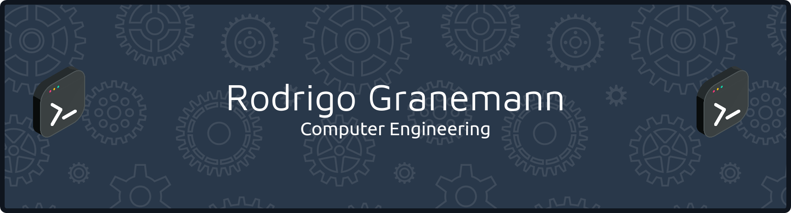
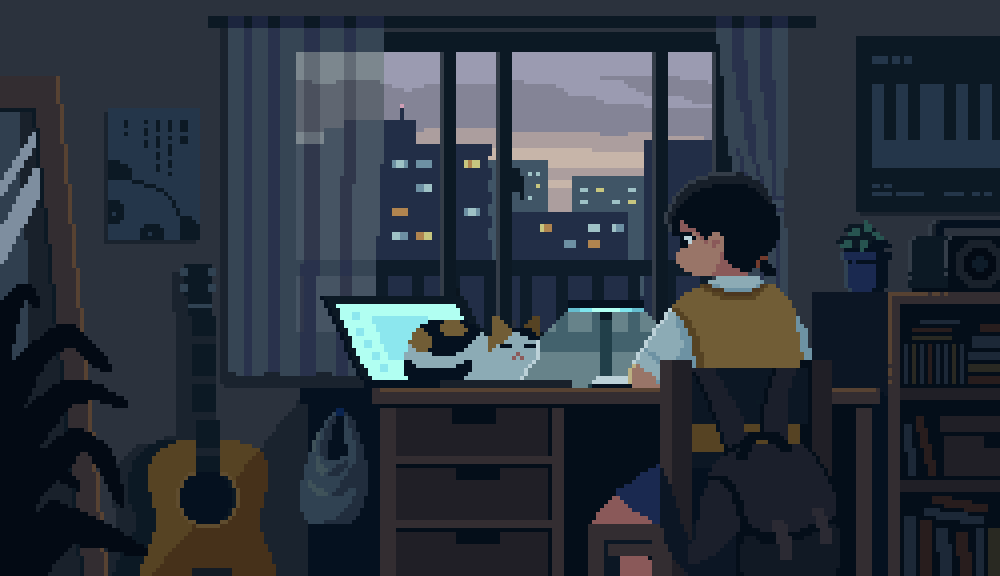

#

Computer Engineering student at the Federal University of Santa Catarina (UFSC). Currently focusing my studies on FPGAs. I am constantly updating my skills and seeking new challenges in the technology field. I have a passion for learning and applying technical knowledge.

#

<h3 align="left">Connect with me!</h3>

  

<h3 align="left">My Stack ~</h3>

#

<picture align="center">
  <source media="(prefers-color-scheme: dark)" srcset="https://raw.githubusercontent.com/pontarolo/pontarolo/output/github-contribution-grid-snake-dark.svg">
  <source media="(prefers-color-scheme: light)" srcset="https://raw.githubusercontent.com/pontarolo/pontarolo/output/github-contribution-grid-snake-dark.svg">
  
</picture>